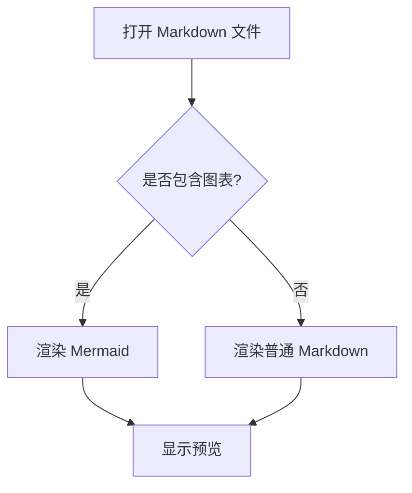
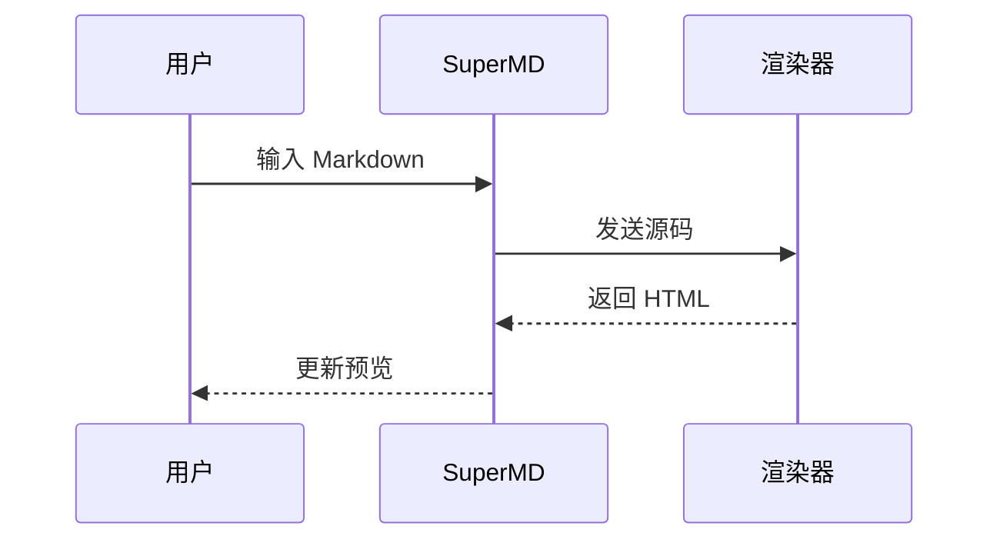
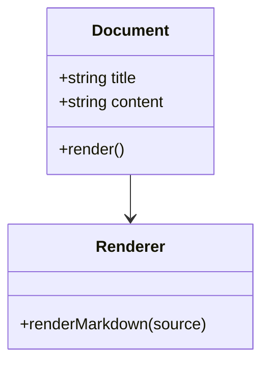
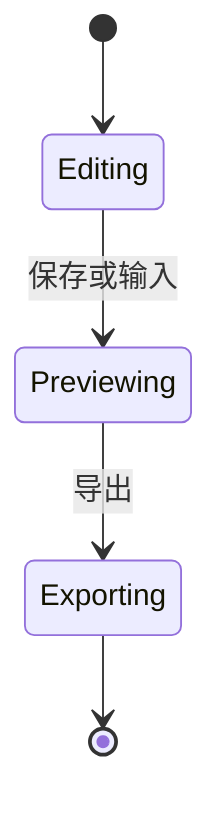
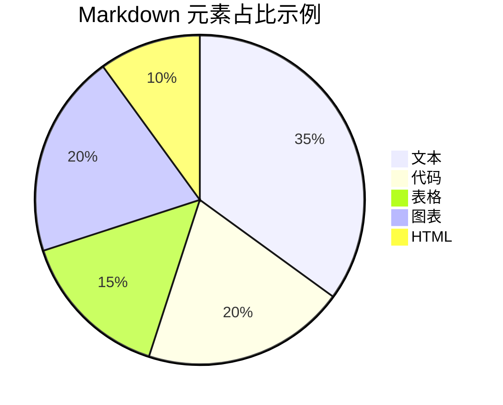

# Markdown 全元素渲染测试文档

> 目标：这份文档用于测试 Markdown 编辑器、预览器、导出器和样式系统对常见元素、扩展语法、嵌套结构以及边界输入的支持情况。

## 目录

- [标题](#标题)
- [段落与换行](#段落与换行)
- [行内样式](#行内样式)
- [链接](#链接)
- [图片](#图片)
- [列表](#列表)
- [引用](#引用)
- [代码](#代码)
- [表格](#表格)
- [分隔线](#分隔线)
- [脚注](#脚注)
- [数学公式](#数学公式)
- [图表](#图表)
- [HTML 混排](#html-混排)
- [转义与特殊字符](#转义与特殊字符)
- [复杂嵌套](#复杂嵌套)
- [边界情况](#边界情况)

## 标题

# 一级标题 H1

## 二级标题 H2

### 三级标题 H3

#### 四级标题 H4

##### 五级标题 H5

###### 六级标题 H6

## 重复标题

这一节用于测试自动生成 slug 时的重复标题处理。

## 重复标题

这一节标题与上一节相同。

## 包含标点、数字和中文的标题 123：你好，Markdown！

标题中包含中文、数字、英文、冒号、逗号、感叹号，用于测试锚点生成。

## 段落与换行

这是一个普通段落。它包含中文、English words、数字 1234567890，以及常见标点：逗号、句号、冒号、分号、问号、感叹号。

这是第二个段落。Markdown 中两个段落之间通常用一个空行分隔。

这一行末尾有两个空格，用于测试硬换行。  
如果渲染正确，这一行应该从新的一行开始，但仍然属于同一段落附近的内容。

这一段使用反斜杠换行\
如果渲染器支持 CommonMark 硬换行，这里也应该换行。

长文本段落测试：在真实文档中，段落可能非常长，需要验证编辑器换行、预览区域宽度、滚动同步和排版是否稳定。这里故意写一段较长的内容，包含 `inline code`、**粗体**、[链接](https://example.com) 和一些中文说明，观察它们在同一段落中是否能够自然排列，不发生溢出或异常断行。

## 行内样式

普通文本。

*斜体，使用星号。*

_斜体，使用下划线。_

**粗体，使用双星号。**

__粗体，使用双下划线。__

***粗斜体，使用三星号。***

___粗斜体，使用三下划线。___

~~删除线，GFM 扩展。~~

`行内代码：const value = "hello";`

组合样式：**粗体中包含 _斜体_、`代码` 和 ~~删除线~~**。

紧贴中文的样式测试：这是**粗体**文本，这是*斜体*文本，这是`代码`文本。

下标和上标不是标准 Markdown：H~2~O，x^2^。如果渲染器没有扩展支持，应按普通文本显示。

高亮不是标准 Markdown：==高亮文本==。如果渲染器没有扩展支持，应按普通文本显示。

## 链接

行内链接：[Example](https://example.com)。

带标题的链接：[Example with title](https://example.com "这是链接标题")。

自动链接：https://example.com/path?query=markdown#hash

邮箱自动链接：<hello@example.com>

尖括号 URL：<https://example.org/angle-bracket-link>

引用式链接：[引用式链接][ref-link]

重复使用引用式链接：[再次引用][ref-link]

空格与中文链接文本：[这是一个中文链接文本](https://example.com/中文路径)

相对路径链接：[项目入口](./index.html)

锚点链接：[跳回标题测试](#标题)

[ref-link]: https://example.com/reference "引用式链接标题"

## 图片

普通图片：


带链接的图片：

[](https://example.com)

引用式图片：

![引用式图片][ref-image]

HTML 图片，带宽高属性：


[ref-image]: https://placehold.co/220x120/png?text=Reference+Image "引用式图片标题"

## 列表

### 无序列表

- 第一项
- 第二项
- 第三项

### 使用不同标记的无序列表

* 星号列表项
* 星号列表项

+ 加号列表项
+ 加号列表项

### 有序列表

1. 第一步
2. 第二步
3. 第三步

### 起始编号不是 1 的有序列表

7. 第七项
8. 第八项
9. 第九项

### 嵌套列表

1. 父级有序列表
   - 子级无序列表
   - 子级无序列表
     1. 第三级有序列表
     2. 第三级有序列表
        - 第四级无序列表
        - 第四级无序列表
2. 第二个父级条目
   1. 子级有序列表
   2. 子级有序列表

### 任务列表

- [x] 已完成任务
- [ ] 未完成任务
- [x] 包含 **粗体**、`代码` 和 [链接](https://example.com) 的任务
- [ ] 包含中文标点：保存、预览、导出。

### 列表中的多段内容

1. 第一项第一段。

   第一项第二段，注意这里需要缩进。

   ```ts
   const insideList = true;
   console.log("代码块位于列表内", insideList);
   ```

2. 第二项第一段。

   > 列表中的引用块。

3. 第三项包含表格：

   | 字段 | 值 |
   | --- | --- |
   | name | SuperMD |
   | type | Markdown preview |

## 引用

> 这是一级引用。

> 这是一级引用。
>
> 它包含第二个段落。

> ### 引用中的标题
>
> - 引用中的列表项
> - 第二个列表项
>
> `引用中的行内代码`

> 嵌套引用第一层
>
> > 嵌套引用第二层
> >
> > > 嵌套引用第三层

## 代码

### 行内代码

使用 `npm run dev` 启动开发服务器。

行内代码包含反引号：`` const text = `template literal`; ``。

### 缩进代码块

    function indentedCodeBlock() {
      return "这是缩进代码块";
    }

### 围栏代码块

```txt
这是无高亮的纯文本代码块。
第一行。
第二行。
```

```js
const markdown = "# Hello Markdown";
const render = (source) => {
  return source.trim();
};

console.log(render(markdown));
```

```ts
type User = {
  id: string;
  name: string;
  roles: Array<"admin" | "editor" | "viewer">;
};

const user: User = {
  id: "u_001",
  name: "测试用户",
  roles: ["admin", "viewer"],
};
```

```tsx
import React from "react";

export function Badge({ children }: { children: React.ReactNode }) {
  return <span className="badge">{children}</span>;
}
```

```json
{
  "name": "supermd",
  "features": ["markdown", "gfm", "math", "diagram"],
  "enabled": true,
  "count": 4
}
```

```bash
npm install
npm run build
npm test
```

```diff
- const oldValue = false;
+ const newValue = true;
```

### 使用波浪线围栏

~~~python
def hello(name: str) -> str:
    return f"Hello, {name}"

print(hello("Markdown"))
~~~

### 代码块中展示 Markdown 原文

````markdown
# 这是一段 Markdown 源码

```js
console.log("嵌套围栏代码块");
```
````

## 表格

### 基础表格

| 名称 | 类型 | 状态 |
| --- | --- | --- |
| 标题 | block | 支持 |
| 段落 | block | 支持 |
| 链接 | inline | 支持 |

### 对齐表格

| 左对齐 | 居中对齐 | 右对齐 |
| :--- | :---: | ---: |
| apple | banana | 100 |
| longer text | center | 2000 |
| 中文内容 | 居中 | 30000 |

### 包含行内样式的表格

| 元素 | 示例 | 说明 |
| --- | --- | --- |
| 粗体 | **bold** | 加粗文本 |
| 代码 | `const x = 1` | 行内代码 |
| 链接 | [link](https://example.com) | 表格内链接 |
| 删除线 | ~~deleted~~ | GFM 删除线 |

### 表格中的转义管道

| 表达式 | 结果 |
| --- | --- |
| `a \| b` | 管道字符被转义 |
| `x && y` | 普通逻辑表达式 |

## 分隔线

下面是星号分隔线。

***

下面是短横线分隔线。

---

下面是下划线分隔线。

___

## 脚注

这是一个普通脚注引用。[^basic-footnote]

这是一个包含长内容的脚注引用。[^long-footnote]

脚注也可以在同一句话中多次出现。[^basic-footnote]

[^basic-footnote]: 这是脚注内容，通常会显示在文档底部。

[^long-footnote]: 这是一个较长脚注。
    它包含缩进的后续段落。
    还可以包含 `行内代码` 和 **强调文本**。

## 数学公式

### 行内公式

这是行内公式：$E = mc^2$。

勾股定理：$a^2 + b^2 = c^2$。

包含希腊字母：$\alpha + \beta = \gamma$。

### 块级公式

$$
\int_{-\infty}^{\infty} e^{-x^2} dx = \sqrt{\pi}
$$

$$
\begin{aligned}
f(x) &= ax^2 + bx + c \\
f'(x) &= 2ax + b
\end{aligned}
$$

$$
\begin{bmatrix}
1 & 2 & 3 \\
4 & 5 & 6 \\
7 & 8 & 9
\end{bmatrix}
$$

## 图表

### Mermaid Flowchart



### Mermaid Sequence Diagram



### Mermaid Class Diagram



### Mermaid State Diagram



### Mermaid Pie Chart



### Mermaid Gantt


### flowchart.js 代码块

```flowchart
st=>start: 开始
op=>operation: 解析 Markdown
cond=>condition: 是否成功?
ok=>end: 显示预览
err=>operation: 显示错误

st->op->cond
cond(yes)->ok
cond(no)->err->op
```

## HTML 混排

### 行内 HTML

这是一段包含 <span title="行内 HTML">span 元素</span> 的文字。

HTML 实体：&copy; &reg; &trade; &lt; &gt; &amp;。

### 块级 HTML

<div class="custom-block">
  <p>这是一个 HTML div，其中包含一个段落。</p>
  <p>如果渲染器允许安全 HTML，这里应该正常显示。</p>
</div>

### details / summary

<details>
  <summary>点击展开详情</summary>

这里是折叠区域中的 Markdown 内容。

- 折叠区域列表项
- 第二个列表项

`折叠区域中的行内代码`

</details>

### 表单元素

<input type="checkbox" checked disabled> HTML checked checkbox

<input type="checkbox" disabled> HTML unchecked checkbox

<button type="button">普通按钮</button>

### HTML 表格

<table>
  <thead>
    <tr>
      <th>字段</th>
      <th>说明</th>
    </tr>
  </thead>
  <tbody>
    <tr>
      <td>html</td>
      <td>原始 HTML 混排测试</td>
    </tr>
  </tbody>
</table>

### HTML 注释

<!-- 这是一段 HTML 注释，通常不应该在预览中可见。 -->

## 转义与特殊字符

转义星号：\*这不是斜体\*。

转义下划线：\_这不是斜体\_。

转义反引号：\`这不是代码\`。

转义井号：\# 这不是标题。

转义方括号：\[这不是链接文本\]。

转义圆括号：\(这不是链接地址\)。

转义感叹号：\! 这不是图片。

转义管道：a \| b。

转义反斜杠：\\。

特殊字符原文：<script>alert("如果安全处理正确，这不应执行");</script>

HTML 实体与 Unicode：&hearts; ♥，&mdash; —，中文标点：“你好”，《测试》。

## 复杂嵌套

> 引用块开始。
>
> 1. 引用中的有序列表
> 2. 第二项包含任务列表：
>    - [x] 已完成
>    - [ ] 未完成
>
> ```js
> console.log("引用中的代码块");
> ```
>
> | 列 A | 列 B |
> | --- | --- |
> | 1 | 2 |

1. 列表中的引用与公式：

   > 公式：$x = \frac{-b \pm \sqrt{b^2 - 4ac}}{2a}$

2. 列表中的图片：

   

3. 列表中的 details：

   <details>
     <summary>列表内折叠内容</summary>
     <p>这里是 HTML 内容。</p>
   </details>

## 边界情况

### 空链接与空图片

空链接文本：[](https://example.com)

空链接地址：[空地址]()

空图片 alt：

### URL 中的括号

[包含括号的 URL](https://example.com/search?q=(markdown))

### 连续强调符号

***这是粗斜体***

****四个星号包裹的文本****

*****五个星号包裹的文本*****

### 未闭合语法

未闭合的 **粗体

未闭合的 `行内代码

未闭合的 [链接文本

### 多空行

这一段下面有多个空行。


这一段在多个空行之后。

### 前后空格

    这是一行以四个空格开头的文本，应被视为缩进代码块。

普通段落后面有很多空格。      

### 非标准 Markdown 扩展兼容性

::: note
这是容器语法测试。如果渲染器不支持，应作为普通文本显示。
:::

!!! warning
    这是 admonition 语法测试。如果渲染器不支持，应作为普通文本或缩进代码显示。

### 原始危险输入安全测试

<a href="javascript:alert('xss')">不安全链接协议测试</a>


<iframe src="https://example.com"></iframe>

## 结束

如果你能看到这一节，说明文档至少已经解析到最后。建议检查：

- 标题锚点是否正确。
- 目录链接是否可跳转。
- 表格对齐是否正确。
- 任务列表 checkbox 是否渲染。
- 代码高亮是否生效。
- 数学公式是否由 KaTeX 渲染。
- Mermaid 与 flowchart 图表是否渲染。
- 原始 HTML 是否经过安全处理。
- 边界输入是否不会破坏整体页面。
