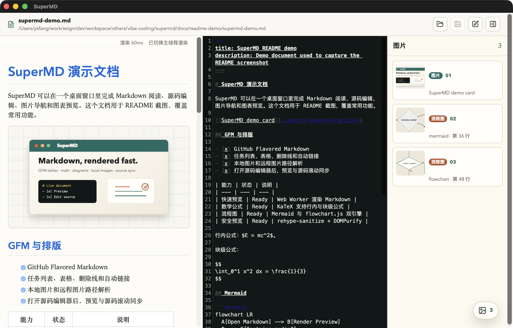

# SuperMD

> 中文 | [English](#english)

SuperMD 是一个基于 Tauri 2 + React 19 的桌面 Markdown 阅读与编辑器。它面向本地文档阅读、快速校对和图文材料整理，把增强预览、源码编辑、快速预览、流程图预览和桌面文件集成放在同一个轻量窗口里。



## 功能特性

- 增强 Markdown 渲染：支持 GFM、front matter、任务列表、表格、代码高亮、数学公式、标题锚点和原始 HTML 清洗。
- 图表预览：支持 Mermaid、flowchart.js 与 PlantUML 代码块，并提供“预览 / 源码”切换。
- 快速预览：侧边栏用 Tab 切换文档目录和图片列表，目录标题可快速跳转定位，图片、HTML 图片和流程图仍可定位并打开灯箱查看。
- 源码编辑：内置 CodeMirror 6，支持行号、Markdown 语法高亮、自动换行、定位源行和保存。
- 滚动同步：预览区与源码区按滚动比例互相同步，适合长文档校对。
- 桌面集成：Tauri 文件对话框、最近文件、系统打开 Markdown 文件、本地资源安全访问和文件关联。
- 渲染韧性：优先使用 Markdown worker，桌面生产环境下 worker 不可用时会自动切换到主线程增强渲染。

## 技术栈

- 桌面框架：Tauri 2、Rust
- 前端框架：React 19、Vite 7、TypeScript
- 编辑器：CodeMirror 6
- Markdown 渲染：unified、remark、rehype、rehype-highlight、KaTeX
- 图表：Mermaid、flowchart.js、PlantUML 在线 SVG 预览
- 安全处理：rehype-sanitize、DOMPurify
- 测试：Vitest、Testing Library、jsdom

## 快速开始

```bash
npm install
npm run tauri:dev
```

只启动 Web 预览：

```bash
npm run dev
```

构建前端资源：

```bash
npm run build
```

构建桌面安装包：

```bash
npm run tauri:build
```

macOS 构建后可用产物：

```text
src-tauri/target/release/supermd
src-tauri/target/release/bundle/dmg/SuperMD_0.1.0_aarch64.dmg
```

`.app` 会被打入 DMG；挂载 DMG 后可从 `/Volumes/SuperMD/SuperMD.app` 运行。

## 项目结构

```text
src/
  App.tsx                     # 主界面、文件操作、预览/编辑/快速预览面板协调
  components/SourceEditor.tsx # CodeMirror 源码编辑器
  lib/markdown.ts             # Markdown 渲染、目录/图片/图表索引、可读 fallback
  lib/diagramRender.ts        # Mermaid 渲染兼容层
  lib/tauriClient.ts          # Tauri 命令与事件封装
  workers/markdown.worker.ts  # Markdown worker 渲染入口
src-tauri/
  src/lib.rs                  # 打开/保存文件、最近文件、系统打开事件
  tauri.conf.json             # 桌面窗口、bundle、CSP 与文件关联配置
docs/readme-demo/             # README 截图演示文档
docs/readme-assets/           # README 截图素材
```

## 已验证

```bash
npm test
npm run build
npm run tauri:build
```

当前验证结果：48 个 Vitest 用例通过；前端构建通过。桌面安装包可按需通过 `npm run tauri:build` 构建。

Vite 构建会提示部分 chunk 超过 500 kB，主要来自 Mermaid、KaTeX、CodeMirror 和 Markdown 渲染链路，属于当前富功能桌面包的已知体积信号。

## 截图素材

README 主图使用 `docs/readme-demo/supermd-demo.md` 作为演示输入，截图保存为 `docs/readme-assets/supermd-main.png`。

---

## English

SuperMD is a Tauri 2 + React 19 desktop Markdown reader and editor. It is built for local document reading, quick review, and media-heavy notes, keeping enhanced preview, source editing, quick preview, diagram preview, and desktop file integration in one lightweight window.


## Features

- Enhanced Markdown rendering: GFM, front matter, task lists, tables, syntax highlighting, math, heading anchors, and sanitized raw HTML.
- Diagram preview: Mermaid, flowchart.js, and PlantUML code blocks with preview/source tabs.
- Quick preview: switches between document outline and image lists in side-panel tabs; headings jump to the matching preview position, while Markdown images, HTML images, and rendered diagrams can still be located and opened in the lightbox.
- Source editing: CodeMirror 6 editor with line numbers, Markdown highlighting, wrapping, source-line focus, and save support.
- Scroll sync: preview and source panes stay aligned by scroll ratio for long-document review.
- Desktop integration: Tauri dialogs, recent files, system Markdown file-open events, safe local asset access, and file associations.
- Rendering resilience: uses the Markdown worker first and falls back to enhanced main-thread rendering when workers are unavailable in the packaged desktop runtime.

## Stack

- Desktop: Tauri 2, Rust
- Frontend: React 19, Vite 7, TypeScript
- Editor: CodeMirror 6
- Markdown: unified, remark, rehype, rehype-highlight, KaTeX
- Diagrams: Mermaid, flowchart.js, PlantUML online SVG preview
- Sanitization: rehype-sanitize, DOMPurify
- Tests: Vitest, Testing Library, jsdom

## Getting Started

```bash
npm install
npm run tauri:dev
```

Run the web preview only:

```bash
npm run dev
```

Build the frontend:

```bash
npm run build
```

Build the desktop app:

```bash
npm run tauri:build
```

macOS build outputs:

```text
src-tauri/target/release/supermd
src-tauri/target/release/bundle/dmg/SuperMD_0.1.0_aarch64.dmg
```

The `.app` is bundled inside the DMG and can be launched from `/Volumes/SuperMD/SuperMD.app` after mounting it.

## Project Layout

```text
src/
  App.tsx                     # Main UI and preview/editor/quick-preview coordination
  components/SourceEditor.tsx # CodeMirror source editor
  lib/markdown.ts             # Markdown rendering, outline/image/diagram indexing, fallback preview
  lib/diagramRender.ts        # Mermaid rendering compatibility layer
  lib/tauriClient.ts          # Tauri command and event wrappers
  workers/markdown.worker.ts  # Markdown worker entry
src-tauri/
  src/lib.rs                  # Open/save files, recent files, system-open events
  tauri.conf.json             # Window, bundle, CSP, and file association config
docs/readme-demo/             # Demo document used for README screenshots
docs/readme-assets/           # README screenshot assets
```

## Verification

```bash
npm test
npm run build
npm run tauri:build
```

Current result: 48 Vitest tests passed; frontend build passed. Desktop packages can be built with `npm run tauri:build` when needed.

Vite reports several chunks over 500 kB, mainly from Mermaid, KaTeX, CodeMirror, and the Markdown rendering pipeline. This is a known size signal for the current rich desktop bundle.

## Screenshot Source

The README screenshot is captured with `docs/readme-demo/supermd-demo.md` and saved as `docs/readme-assets/supermd-main.png`.
