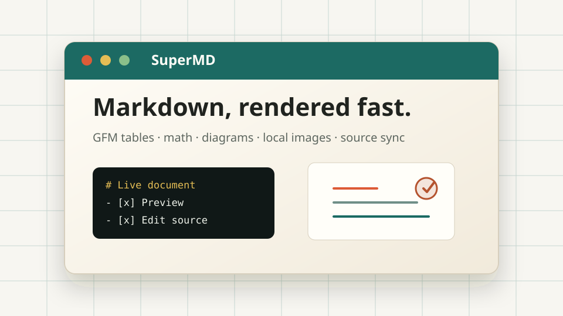
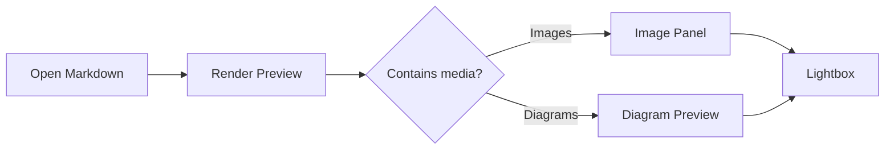

# SuperMD 演示文档

SuperMD 可以在一个桌面窗口里完成 Markdown 阅读、源码编辑、图片导航和图表预览。这个文档用于 README 截图，覆盖常用功能。



## GFM 与排版

- [x] GitHub Flavored Markdown
- [x] 任务列表、表格、删除线和自动链接
- [x] 本地图片和远程图片路径解析
- [x] 打开源码编辑器后，预览与源码滚动同步

| 能力 | 状态 | 说明 |
| --- | --- | --- |
| 快速预览 | Ready | Web Worker 渲染 Markdown |
| 数学公式 | Ready | KaTeX 支持行内与块级公式 |
| 流程图 | Ready | Mermaid 与 flowchart.js 双引擎 |
| 安全预览 | Ready | rehype-sanitize + DOMPurify |

行内公式：$E = mc^2$。

块级公式：

$$
\int_0^1 x^2 dx = \frac{1}{3}
$$

## Mermaid



## flowchart.js

```flowchart
st=>start: Open document
op=>operation: Render Markdown
cond=>condition: Image or diagram?
panel=>operation: Show side panel
done=>end: Read and edit

st->op->cond
cond(yes)->panel->done
cond(no)->done
```

## 代码高亮

```ts
type SuperMDFeature = "preview" | "editor" | "images" | "diagrams";

const enabled: SuperMDFeature[] = ["preview", "editor", "images", "diagrams"];
console.log(enabled.join(" + "));
```

> 小提示：右上角的源码按钮可以打开 CodeMirror 编辑器，图片按钮可以打开文档媒体索引。
